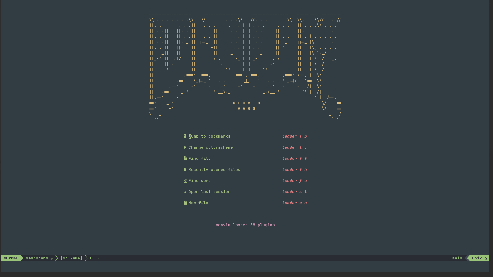
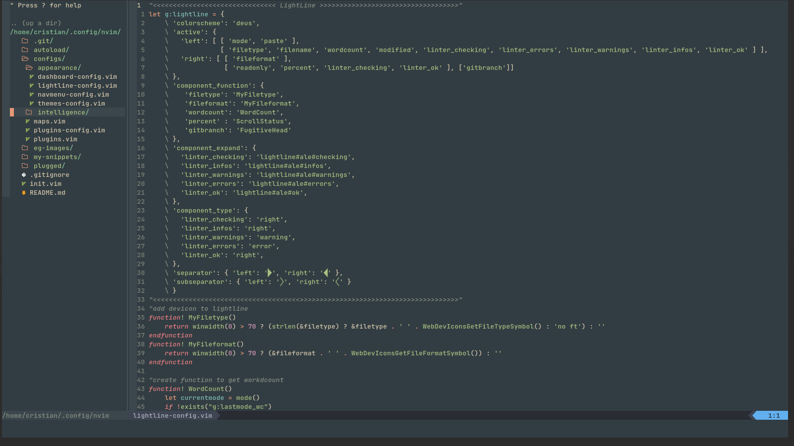
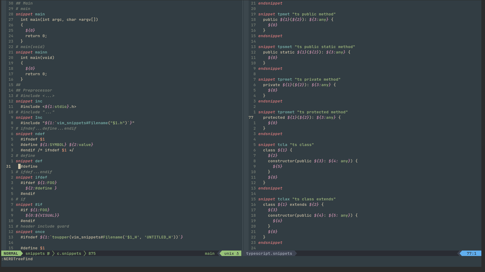
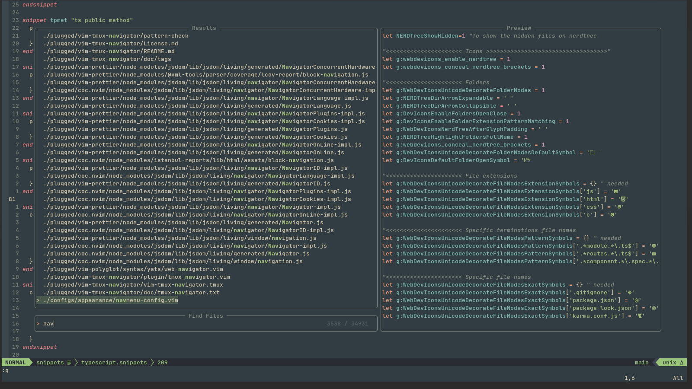
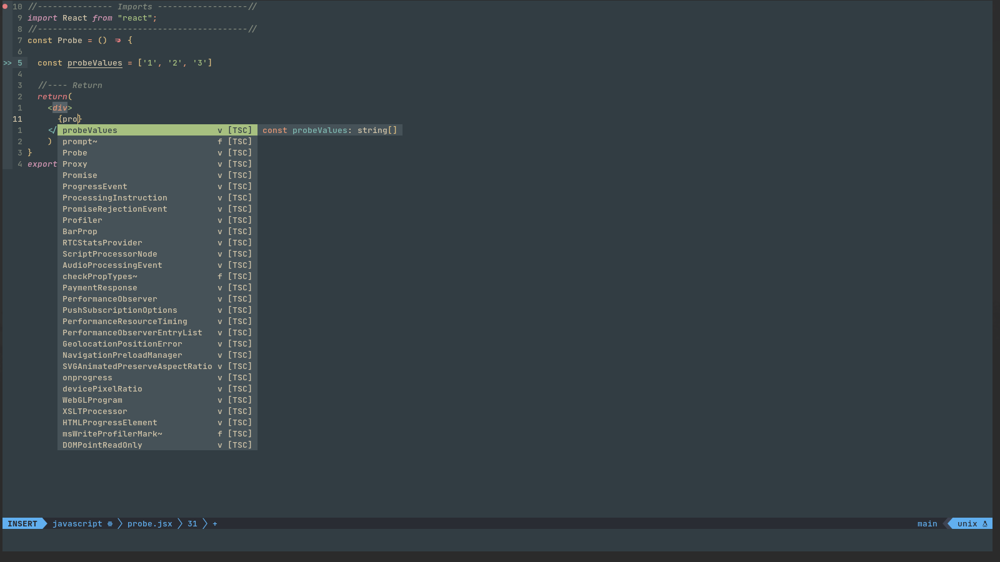
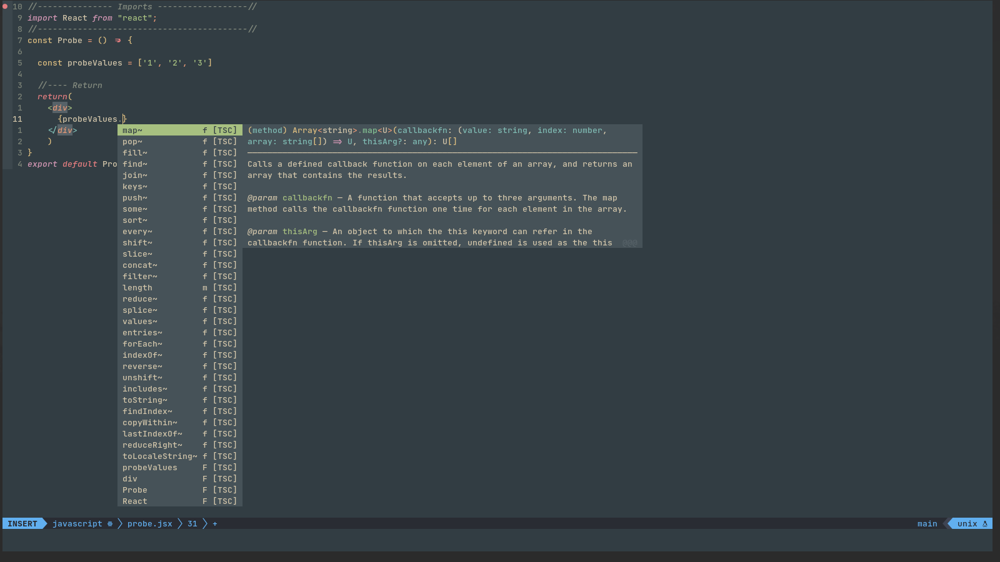

# nvim 
## This is my configuration for neovim (I use neovim-nightly-bin) :shipit:
### Dependencies
1. Install [neovim-nightly-bin](https://aur.archlinux.org/packages/neovim-nightly-bin/) package, in this case, I use Manjaro (based on ArchLinux).
   > yay -S neovim-nightly-bin
2. It is necessary to have installed *__yarn__* in the system, because several plugins use it, for example, Prettier.
   > npm i -g yarn
3. In order to see the icons in the navigation tree, we need some sources, some DE already have them (like KDE), in my case I use XFCE and it is necessary to install the following:
   > yay -S nerd-fonts-fira-code otf-powerline-symbols-git ttf-all-the-icons ttf-devicons ttf-material-design-icons ttf-weather-icons
4. We need pynvim library for python
   > pip3 install pynvim
5. Install prettier
   > npm i -g prettier
### Get started
1. Clone this repository on the *__~/.config/__* path.
   > cd ~/.config/ && git clone https://github.com/cristianvarg11/nvim.git
2. Open neovim with the *__nvim__* command, in case of exist errors, is normal so, press enter untill they disappear. Then, type:
   >  :PlugInstall (This take a few minutes, depends on your internet connection speed).
3. (Optional) To rename *__nvim__* command with another name, create a symlink, type on the termnial: 
   > *__cd /usr/bin && sudo ln -s nvim nv__* ("rename" nvim as nv)
### Reference imgaes

